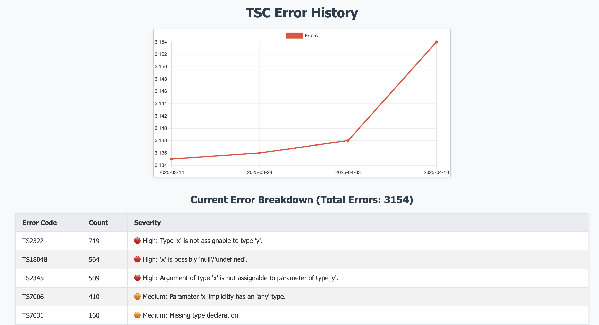

# 🛡️ Iron Golem – TypeScript Error Historian

**Iron Golem** is a CLI tool that analyzes TypeScript errors over time using your Git history.  
It helps your team track and reduce `tsc` errors with visual reports.

---

## ✨ Features

- ⏳ **Time-travel Debugging**: Check how your TypeScript errors evolve across commits.
- 📊 **Visual Reports**: Generates an HTML chart of error counts over time.
- 🔎 **Error Breakdown**: Shows a table with error codes, counts, severity, and messages.
- 🧠 **Severity Analysis**: Classifies errors into 🔴 High, 🟠 Medium, and 🟢 Low severity.
- 🧪 **Strict Audit Mode**: Adds a `tsc --noEmit` pre-commit script to prevent regressions.
- 💾 **Safe & Cached**: Uses Git safely, always resets to your working branch.

---

## 📦 Installation

[NPM package](https://www.npmjs.com/package/iron-golem-ts) is available.

```bash
npm install --save-dev iron-golem-ts
```

Or clone manually:

```bash
git clone https://github.com/programever/iron-golem-ts
cd iron-golem-ts
npm install
npm build
npm link
```

---

## 🚀 Usage

### Use cases:
- **Audit**: Check your TypeScript errors over time. Please use -k `none`.
- **Git Changes**: Check your TypeScript errors for the current git changes. Please use -k `changes`. This will be used as a pre-commit hook to prevent errors from being committed.

```bash
iron-golem-ts [options]
iron-golem-ts -k none -s 10 -m 1 -p build -n ~/.nvm/nvm.sh
iron-golem-ts -k changes
```

> **Note:** `iron-golem-ts` runs `tsc --noEmit` with `strict` and `strictNullChecks` options enabled. This ensures maximum type safety and strict mode during your audits.

### Options

| Option               | Description                                                | Default    |
|----------------------|------------------------------------------------------------|------------|
| `-k, --kind`         | Kind is either `none` or `changes`                         | `none`     |
| `-s, --sequence`     | Day interval for Git history audit                         | `7`        |
| `-m, --max-months`   | Maximum age for audit (in months)                          | `3`        |
| `-p, --path`         | Output path for the generated report                       | `tmp`      |
| `-n, --nvm-path`     | Determine if should use nvm Eg: `~/.nvm/nvm.sh`)           | ``         |

> **Note:** `kind` `none` will use `-s` `-m` `-p` `-n` options. `kind` `changes` will not use anything, it will just base on your current branch and run tsc.

### View the HTML report

Just open:

```
tmp/iron-golem-ts/report.html
```

You'll see:
- A chart of error counts over time.
- A table showing error codes, how often they appear, and their severity.
- A table files with error count and codes.

---

## 📁 Output Structure

```
tmp/iron-golem-ts/
  ├── cache.json      # Parsed error data per commit
  └── report.html     # Full HTML report
```

---

## 🧠 How Audit History Works

- Walks backward in Git history (e.g., one per day or week).
- Runs `tsc --noEmit` at each point in time with `strict` and `strictNullChecks` enabled for high type safety.
- Collects errors and maps them with timestamps + commit hashes.
- Outputs a report with trends and breakdowns.

---

## 🧠 How Git File Changes Works

- Runs `tsc --noEmit` for the change files from git.
- If there are errors, it will show the file name together with errors.

---

## 🛑 Safety & Git Awareness

- Uses your current working branch (e.g., `develop`).
- Aborts if there are uncommitted files.
- Resets back to the original working branch after completion.

---

## 🔍 Pre-commit Integration

To enforce zero `tsc` errors before commits for change files ONLY:

```jsonc
// package.json
"scripts": {
  "precommit:tsc": "iron-golem-ts -k changes"
}
```

And optionally:

```bash
npm run precommit:tsc
```

---

## 🧪 Example Report



[https://jsfiddle.net/programever/Lswyhp7u/11/](https://jsfiddle.net/programever/Lswyhp7u/11/)


---

## 🤝 Contributing

PRs and feedback welcome!  
If you have suggestions or want to help expand this tool (e.g., monorepo support, GitHub Actions), open an issue or pull request.

---

## 📜 License

MIT — feel free to use, fork, or remix.

---

## 🧙 Author

**Iker (aka programever)**  
BedrockTS, PureScript lover, FP warrior  
🌐 [github.com/programever](https://github.com/programever)
