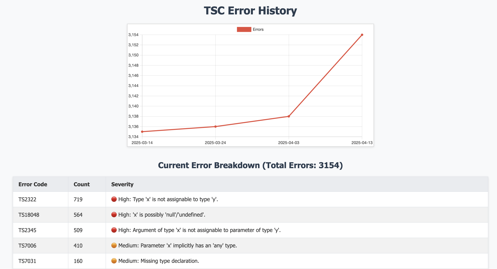

# 🛡️ Iron Golem – TypeScript Error Historian

**Iron Golem** is a CLI tool that analyzes TypeScript errors over time using your Git history.  
It helps your team track and reduce `tsc` errors with visual reports.

---

## ✨ Features

- ⏳ **Time-travel Debugging**: Check how your TypeScript errors evolve across commits.
- 📊 **Visual Reports**: Generates an HTML chart of error counts over time.
- 🔎 **Error Breakdown**: Shows a table with error codes, counts, severity, and messages.
- 🧠 **Severity Analysis**: Classifies errors into 🔴 High, 🟠 Medium, and 🟢 Low severity.
- 🧪 **Strict Audit Mode**: Adds a `tsc --noEmit` pre-commit script to prevent regressions.
- 💾 **Safe & Cached**: Uses Git safely, always resets to your working branch.

---

## 📦 Installation

[NPM package](https://www.npmjs.com/package/iron-golem-ts) is available.

```bash
npm install --save-dev iron-golem-ts
```

Or clone manually:

```bash
git clone https://github.com/programever/iron-golem-ts
cd iron-golem-ts
npm install
npm run build
npm link
```

---

## 🚀 Usage

### Use cases:
- **Audit**: Check your TypeScript errors over time. Please use -k `audit`.
- **Git Changes**: Check your TypeScript errors for the current git changes. Please use -k `changes`. This will be used as a pre-commit hook to prevent errors from being committed.

```bash
iron-golem-ts [options]
iron-golem-ts -k audit -s 10 -m 1 -p build -n ~/.nvm/nvm.sh
iron-golem-ts -k changes
iron-golem-ts -k report -rp / -rd 3
```

> **Note:** `iron-golem-ts` runs `tsc --noEmit` with `strict` and `strictNullChecks` options enabled. This ensures maximum type safety and strict mode during your audits.

> **Note:** The audited project's own TypeScript (`node_modules/.bin/tsc`) is used, so historical commits are checked with the compiler version they were written against.

### Options

| Option               | Description                                                | Default    |
|----------------------|------------------------------------------------------------|------------|
| `-k, --kind`         | Kind is `audit` - `changes` - `report`                     | `audit`    |
| `-s, --sequence`     | Day interval for Git history audit (whole number >= 1)     | `7`        |
| `-m, --max-months`   | Maximum age for audit, in months (whole number >= 1)       | `3`        |
| `-p, --path`         | Output path for the generated report                       | `tmp`      |
| `-n, --nvm-path`     | Determine if should use nvm Eg: `~/.nvm/nvm.sh`            | ``         |
| `-rp, --report-path` | What is the path to run report Eg: `/app`                  | `/`        |
| `-rd, --report-depth`| What is the depth level that report should go down (>= 0)  | `999`      |

> **Note:** `kind` `audit` will use `-s` `-m` `-p` `-n` options. 
> **Note:** `kind` `changes` do not use any options.
> **Note:** `kind` `report` will use `-rp` `-rd` options.

### View the HTML report

Just open:

```
tmp/iron-golem-ts/report.html
```

You'll see:
- A chart of error counts over time.
- A table showing error codes, how often they appear, and their severity.
- A table files with error count and codes.

---

## 📁 Output Structure

```
tmp/iron-golem-ts/
  ├── cache.json      # Parsed error data per commit
  └── report.html     # Full HTML report
```



[https://jsfiddle.net/programever/Lswyhp7u/11/](https://jsfiddle.net/programever/Lswyhp7u/11/)

---

## 🧠 How Audit History Works

- Walks backward in Git history (e.g., one per day or week).
- Runs `tsc --noEmit` at each point in time with `strict` and `strictNullChecks` enabled for high type safety.
- Collects errors and maps them with timestamps + commit hashes.
- Outputs a report with trends and breakdowns.

---

## 🧠 How Git File Changes Works

- Runs `tsc --noEmit` for the change files from git.
- If there are errors, it will show the file name together with errors.

---

## 🛑 Safety & Git Awareness

- Uses your current working branch (e.g., `develop`).
- Aborts if there are uncommitted files.
- Resets back to the original working branch after completion, including when the
  audit fails part-way through or you interrupt it with Ctrl-C.
- Your `tsconfig.json` is temporarily rewritten to force strict mode, then restored
  byte-for-byte from an in-memory snapshot. Uncommitted edits to it are never lost,
  and comments (JSONC) are supported.

---

## 🔍 Pre-commit Integration

To enforce zero `tsc` errors before commits for change files ONLY:

```jsonc
// package.json
"scripts": {
  "precommit:tsc": "iron-golem-ts -k changes"
}
```

And optionally:

```bash
npm run precommit:tsc
```

Example:
```bash
vc-fenx on  develop [⇣+] via ⬢ v22.15.0
➜ git commit -m "Init commit"
🚀 Checking strict TypeScript is running...
💀 TypeScript errors for files:
src/components/orders-sales/main.tsx(43,7): error TS2531: Object is possibly 'null'.
src/components/orders-sales/main.tsx(252,21): error TS2322: Type 'SaleReport[] | undefined' is not assignable to type 'SaleReport[]'.
src/components/orders-sales/main.tsx(273,11): error TS2322: Type 'SaleData | undefined' is not assignable to type 'SaleData'.
husky - pre-commit hook exited with code 1 (error)
```

---

## 🗂️ Report by Folder

To generate a report by folder:

```jsonc
// package.json
"scripts": {
  "report:tsc": "iron-golem-ts -k report -rp /config -rd 3" 
}
```

And optionally:

```bash
npm run report:tsc
```

Example:
```bash
🚀 Iron Golem is running...
Legend: 🔴 ≥75% | 🟠 50–74% | 🟢 25–49% | ⚪ <25% (relative to parent folder)
Run for: /config with 3 max level depth
🔴 config: 94 - 100%
  ├── ⚪ axios.ts: 4 - 4%
  ├── 🔴 catalog: 86 - 92%
    ├── 🟠 filter-group-configurations.ts: 48 - 56%
    └── 🟢 hotfilter-group-configurations.ts: 38 - 44%
  └── ⚪ environment.tsx: 4 - 4%

```

---

## 🧑‍💻 Development

Developed on Node 24 (see `.nvmrc`); the published package supports Node >= 20 and
CI runs the suite on 20, 22 and 24.

```bash
npm install
npm run check   # tsc --noEmit, eslint and the test suite
npm run build
```

Tests use the built-in Node test runner (`node --test`); no extra dependency is
required. They live in `test/`, mirroring the `src/` layout, and are type-checked
and linted along with the source but excluded from the published build.

---

## 🚢 Releasing

Publishing is automated. Pushing (or merging) to `main` runs CI on Node 20, 22 and
24, and then publishes to npm **only if `version` in `package.json` is not already
on the registry**. Pushes that do not change the version pass through without
publishing.

To cut a release:

```bash
npm version patch   # or minor / major
git push --follow-tags
```

The workflow builds `dist/` via `prepublishOnly`, publishes with
[npm provenance](https://docs.npmjs.com/generating-provenance-statements), and
tags the commit `v<version>`.

**One-time setup:** add an npm
[granular access token](https://docs.npmjs.com/creating-and-viewing-access-tokens)
with publish rights for this package as the repository secret `NPM_TOKEN`
(*Settings → Secrets and variables → Actions*).

---

## 🧶 TODO:

- Support Yarn

---

## 🤝 Contributing

PRs and feedback welcome!  
If you have suggestions or want to help expand this tool (e.g., monorepo support, GitHub Actions), open an issue or pull request.

---

## 📜 License

MIT — feel free to use, fork, or remix.

---

## 🧙 Author

**Iker (aka programever)**  
BedrockTS, PureScript lover, FP warrior  
🌐 [github.com/programever](https://github.com/programever)
